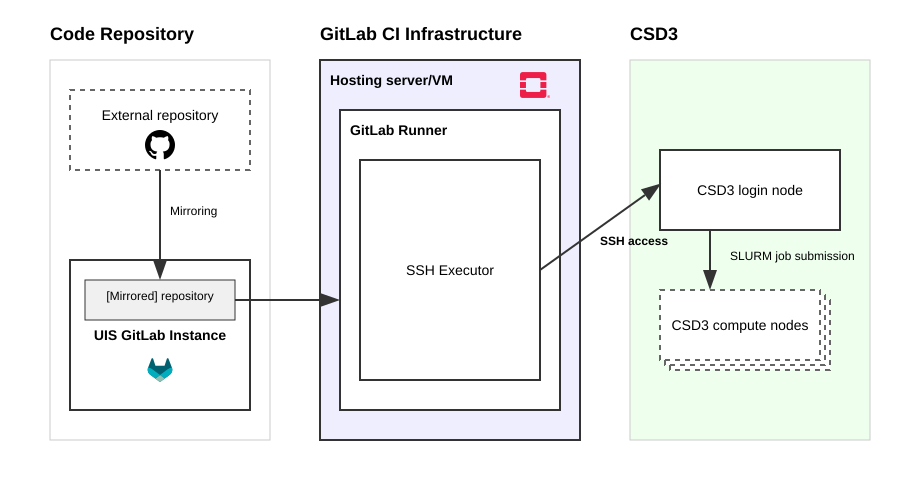
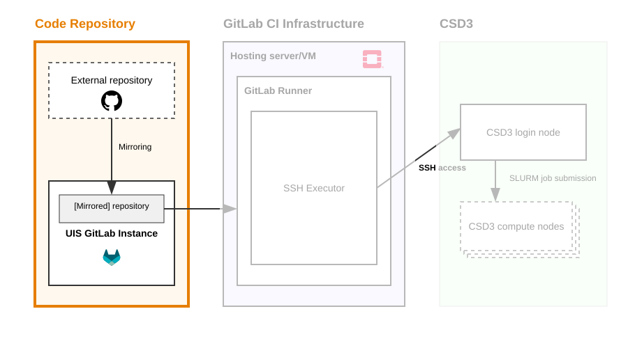
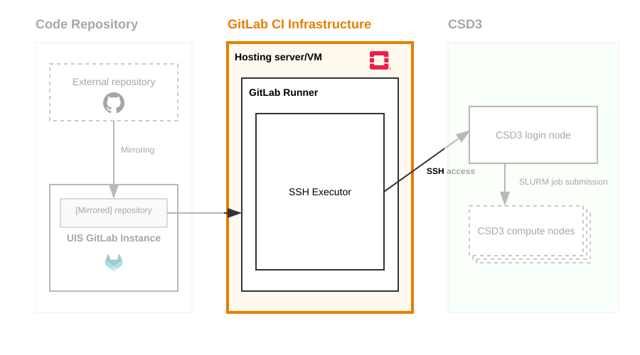
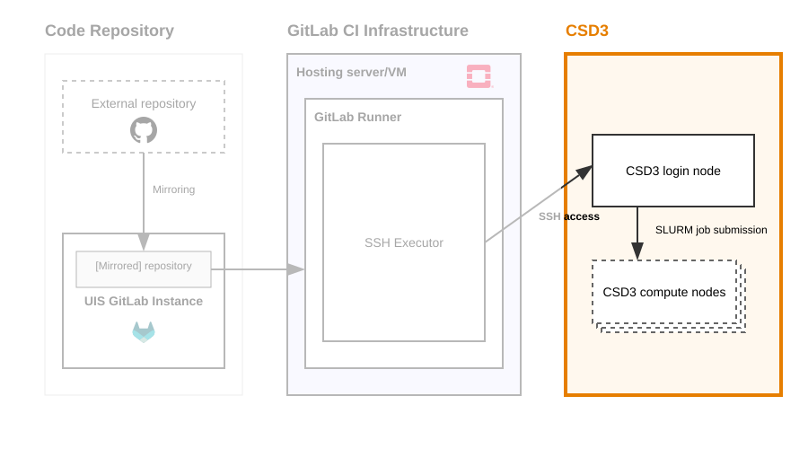

## Documentation

## Why run CI on CSD3?

## Overview

# Code Repository

##

## UIS GitLab Instance

## External repository mirroring

# GitLab CI Infrastructure

##

## Host server/VM

## GitLab Runner

## GitLab CI workflow

# CSD3

##

## Service Accounts

## Tips and gotchas

# Demo: GRTeclyn CI on CSD3 A100s

